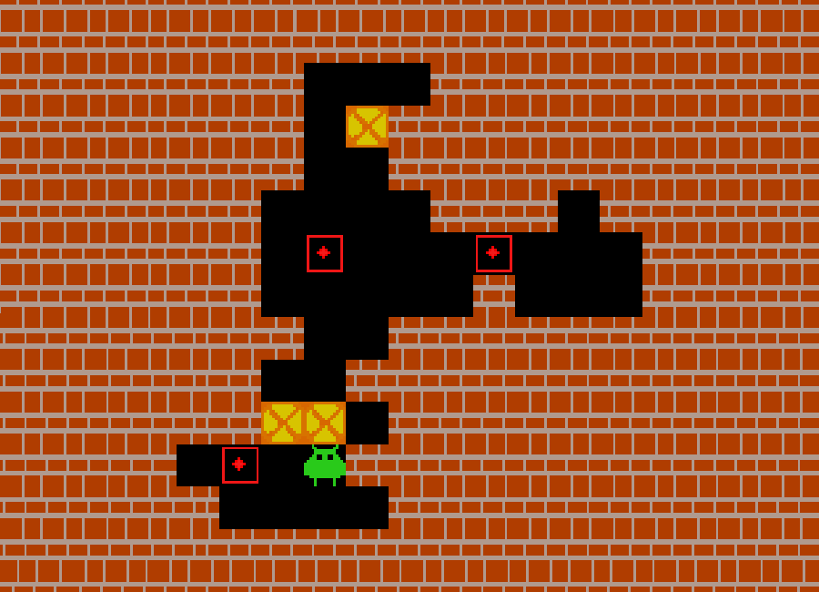

# Policy-guided planning
This is my <a href="https://antoineschmidt.github.io/Portfolio/projects/sokoban_planner/media/thesis.pdf">master thesis</a>
which explores different approaches to apply collected knowledge from small problem instances to big instances, with the
goal to improve the problem solving process.

The final Sokoban-planner can be run in the *<a href="plan.ipynb">plan.ipynb</a>* notebook.

    

